<p align="center">
  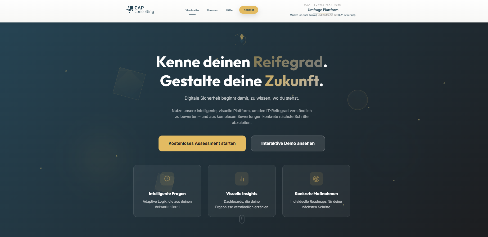
</p>

<h1 align="center">ICA³ — Integrated Customer Assessments & Advanced Analytics</h1>

<p align="center">
  A full-featured SaaS web platform for conducting, managing, and analyzing structured assessments for companies and their employees.
</p>

<p align="center">
  
  
  
  
  
  
  
  
</p>

---

## Table of Contents

- [Overview](#overview)
- [Screenshots](#screenshots)
- [Features](#features)
- [Architecture](#architecture)
- [Tech Stack](#tech-stack)
- [Getting Started](#getting-started)
- [Project Structure](#project-structure)
- [API Documentation](#api-documentation)
- [Database Design](#database-design)
- [Docker Deployment](#docker-deployment)
- [Team](#team)
- [Roadmap](#roadmap)
- [License](#license)

---

## Overview

**ICA³** replaces fragmented legacy tools (Excel, email, manual evaluation) with an integrated digital solution for structured company assessments. It serves as both a **functional assessment tool** and a **marketing instrument** — customers (workers) can take self-assessments via invitation links without needing login credentials, while administrators build catalogs, manage questions, and analyze results through rich dashboards.

Built as a production-ready platform on commission from **CapConsulting GmbH**, the system manages the entire lifecycle of IT maturity assessments:

- **Create** catalogs with themes, questions (8 types), and conditional navigation logic
- **Assign** assessments to workers via invitation links and 6-digit access codes
- **Conduct** assessments with progress tracking, session persistence, and resume support
- **Score** answers automatically or manually with configurable maturity models
- **Analyze** results through real-time dashboards, time series, and PDF exports
- **Audit** all system actions with a complete activity trail

---

## Screenshots

### Authentication & Landing

<p align="center">
  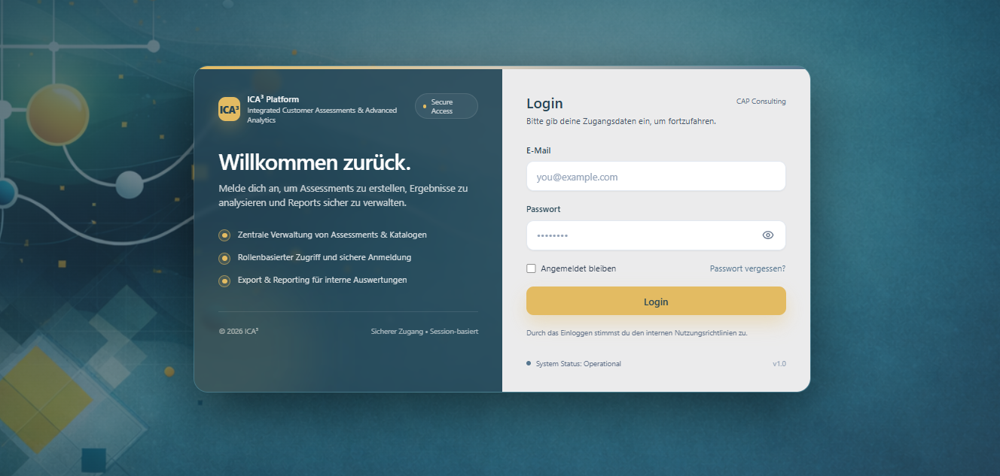
  <br>
  <em>Login Page — Split-screen design with branded visuals</em>
</p>

<p align="center">
  
  <br>
  <em>Marketing Landing Page — Hero section for customer acquisition</em>
</p>

### Assessment Flow

<p align="center">
  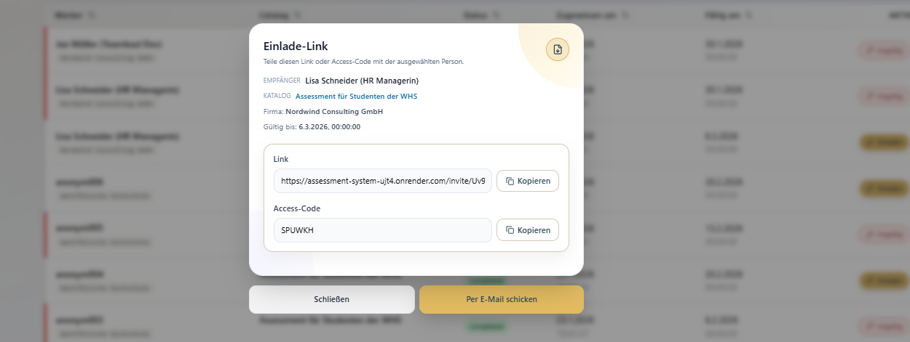
  <br>
  <em>Invitation Page — 6-digit code entry for worker access</em>
</p>

<p align="center">
  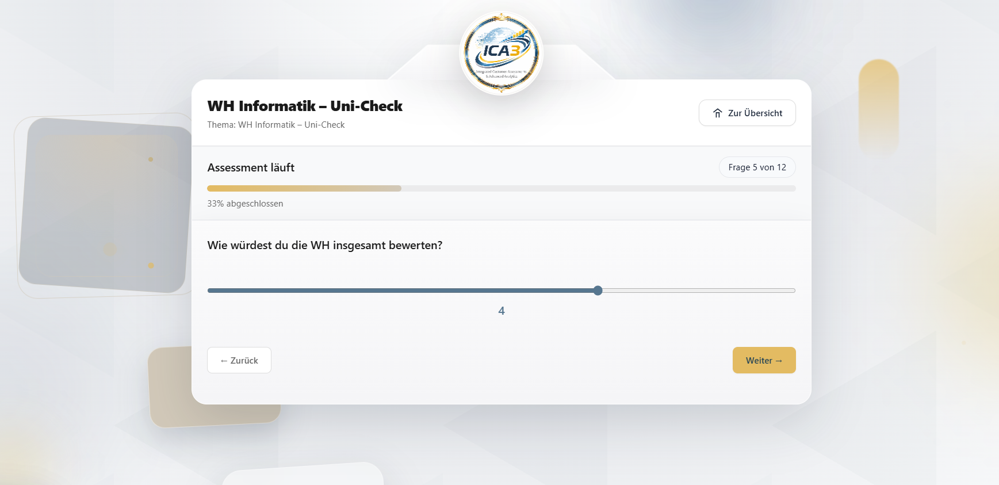
  <br>
  <em>Assessment Question View — Progress bar and Rating Scale question type</em>
</p>

<p align="center">
  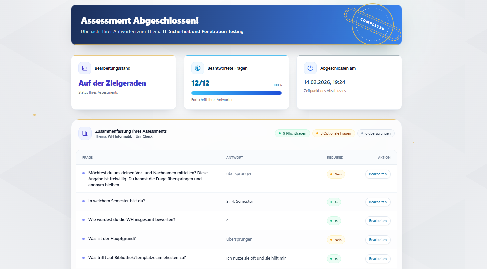
  <br>
  <em>Assessment Completion — Confetti celebration animation on finish</em>
</p>

<p align="center">
  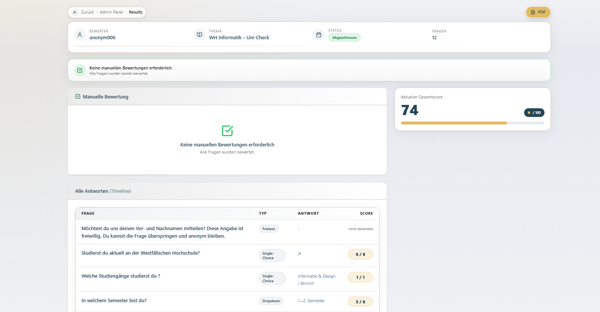
  <br>
  <em>Assessment Results — Score overview with detailed breakdown</em>
</p>

### Admin Dashboard & Analytics

<p align="center">
  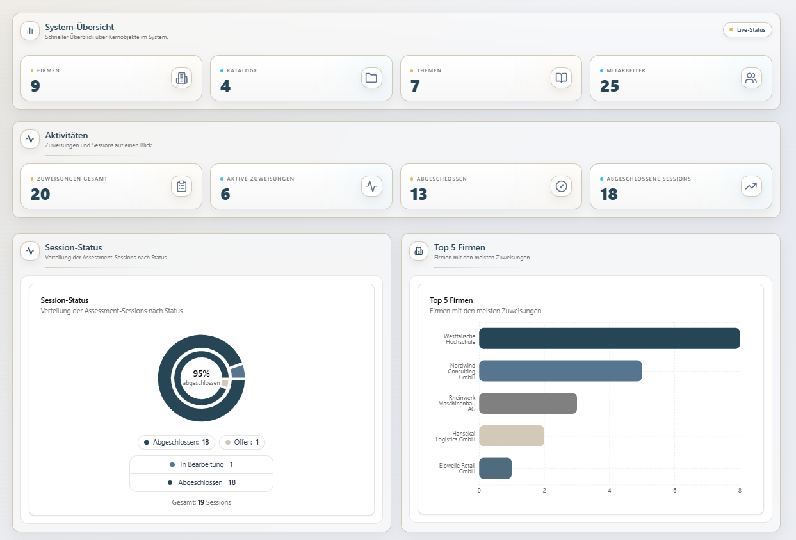
  <br>
  <em>Admin Dashboard — Statistics cards, status distribution pie chart, and top companies</em>
</p>

<p align="center">
  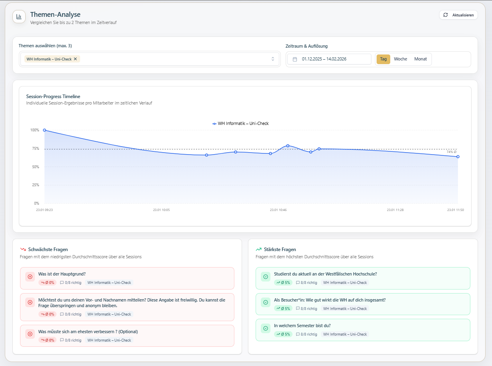
  <br>
  <em>Theme Time Series Analysis — Area chart with theme selector and date filters</em>
</p>

<p align="center">
  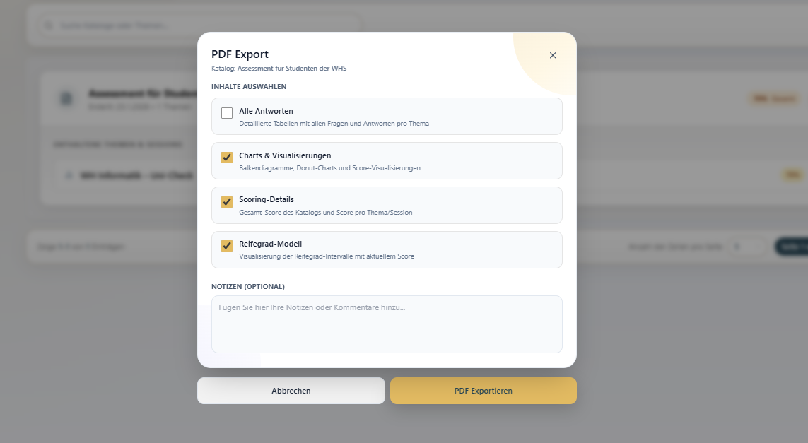
  <br>
  <em>PDF Export Dialog — Preview and export of assessment reports</em>
</p>

### Catalog & Theme Management

<p align="center">
  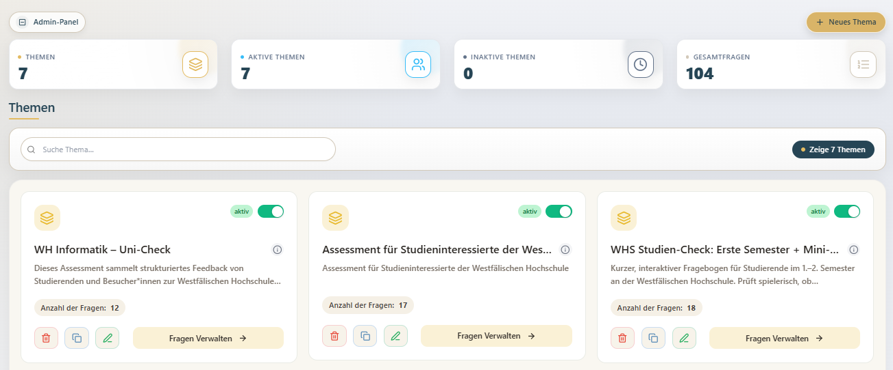
  <br>
  <em>Admin Theme Management — Topic cards with search and filter options</em>
</p>

<p align="center">
  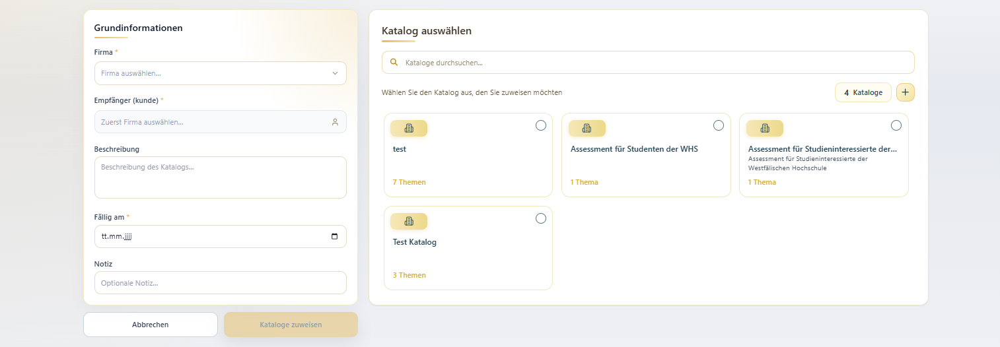
  <br>
  <em>Catalog Management — Maturity model assignment to catalogs</em>
</p>

<p align="center">
  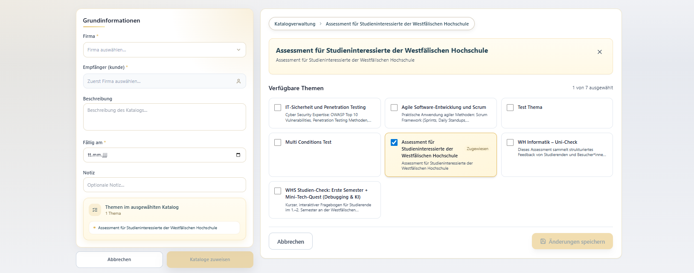
  <br>
  <em>Catalog Detail View — Themes with assigned questions</em>
</p>

<p align="center">
  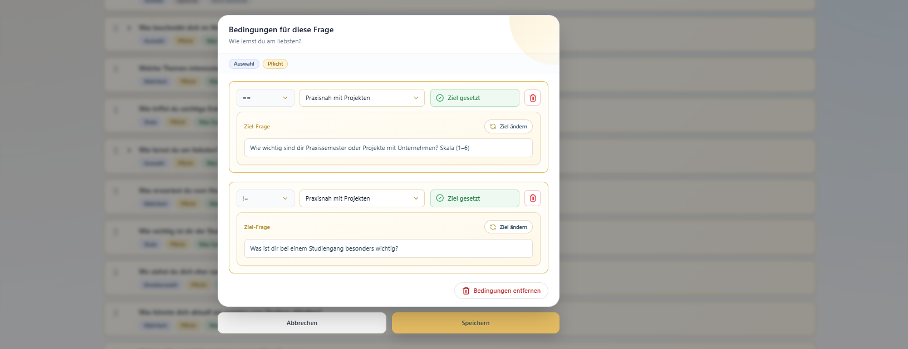
  <br>
  <em>Condition Editor — Visual editor for conditional question navigation</em>
</p>

### Maturity Models & Scoring

<p align="center">
  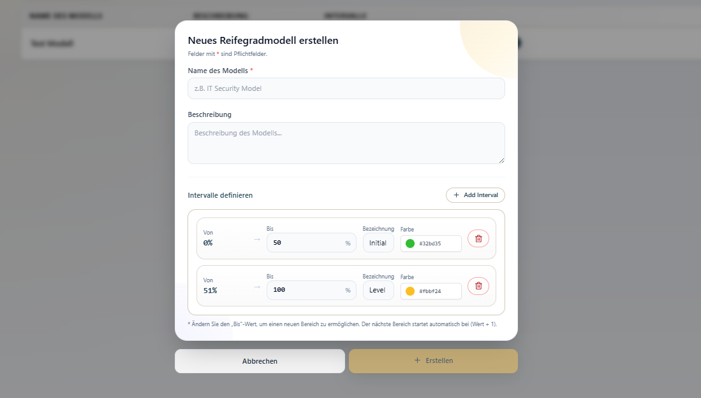
  <br>
  <em>Maturity Model Management — Configurable intervals with percentage ranges and color coding</em>
</p>

### Administration

<p align="center">
  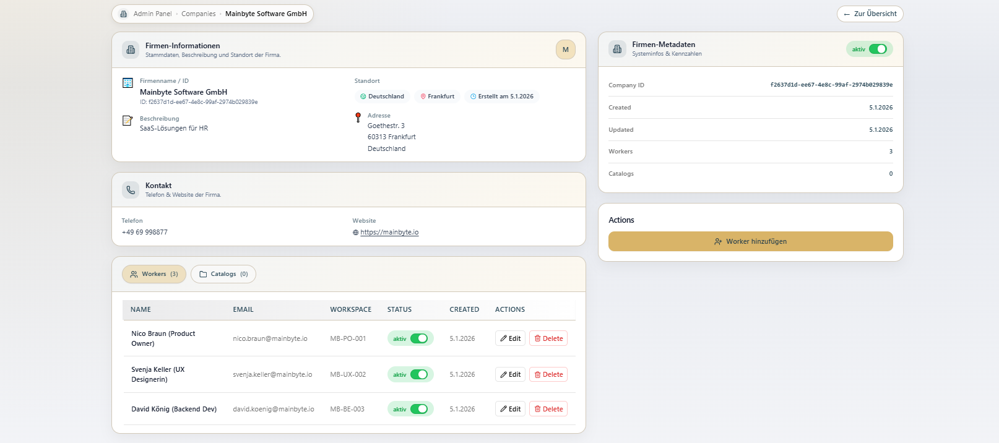
  <br>
  <em>Admin Panel — User and company management interface</em>
</p>

<p align="center">
  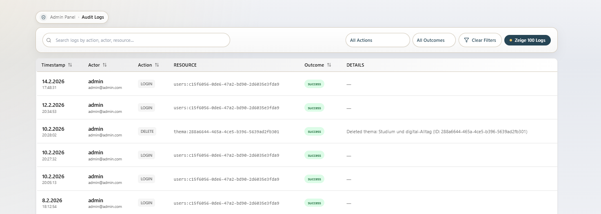
  <br>
  <em>Audit Log — Complete activity trail with filter options</em>
</p>

<p align="center">
  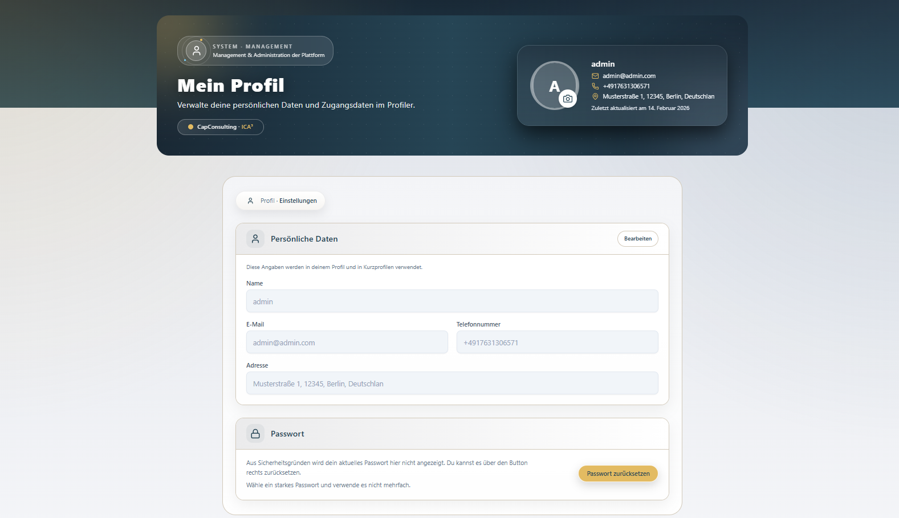
  <br>
  <em>User Profile — Profile page with avatar upload</em>
</p>

---

## Features

| Module | Description |
|--------|-------------|
| **Authentication** | JWT dual-token model (Access Token 2h in-memory + Refresh Token 7d httpOnly cookie) |
| **User Management** | Full CRUD, profile picture upload, status management |
| **Company Management** | Company CRUD with address/contact data, active/inactive status |
| **Worker Management** | Employees within companies with access codes (no login required) |
| **Catalog Management** | Assessment catalogs bundling multiple themes with optional maturity model assignment |
| **Theme Management** | Topics within catalogs — card-grid view, search/filter, duplication, status toggle |
| **Question Management** | 8 question types: Text, Multiple Choice, Multiple Select, Dropdown, Number, Date, Rating Scale, Ordering (drag-and-drop) |
| **Condition System** | Conditional question navigation — skip questions based on answers using `==`, `!=`, `>`, `<`, `contains` |
| **Catalog Assignments** | Assign via invitation links + 6-digit access codes; single & bulk assignment |
| **Assessment Engine** | One question per page, progress bar, back/forward navigation, session persistence, resume support |
| **Scoring** | Auto-scoring (MC/MS/Dropdown/Rating) + manual scoring (Text/Number/Date/Ordering) |
| **Maturity Models** | Configurable intervals with percentage ranges and color coding |
| **Dashboard & Analytics** | Real-time stats, pie/bar charts, time series analysis, question extremes |
| **PDF Export** | Client-side PDF generation via jsPDF + html2canvas |
| **Audit Logging** | Complete trail: LOGIN, LOGOUT, CREATE, UPDATE, DELETE, DUPLICATE, STATUS_CHANGE, ASSIGN_CATALOG |
| **Role Management** | RBAC with 3 predefined roles and 37+ granular permissions |
| **Password Reset** | Via Twilio WhatsApp with 3-step verification process |

---

## Architecture

```
┌──────────────────┐       HTTPS/JSON        ┌──────────────────────┐       JDBC/SQL       ┌──────────────────┐
│                  │ ◄────────────────────► │                      │ ◄──────────────────► │                  │
│   React SPA      │                         │   Spring Boot API    │                       │   PostgreSQL     │
│   (Port 5173)    │                         │   (Port 8080)        │                       │   (Port 5432)    │
│                  │                         │                      │                       │                  │
│  • TypeScript    │                         │  • 22 Controllers    │                       │  • 20+ Tables    │
│  • Vite          │                         │  • 100+ Endpoints    │                       │  • UUID PKs      │
│  • Tailwind CSS  │                         │  • JWT Security      │                       │  • JSONB Columns │
│  • Recharts      │                         │  • 37+ Permissions   │                       │  • 24 Indexes    │
│  • Framer Motion │                         │  • AOP Permission    │                       │                  │
└──────────────────┘                         └──────────┬───────────┘                       └──────────────────┘
                                                        │
                                              ┌─────────┴─────────┐
                                              │                   │
                                        ┌─────▼─────┐     ┌──────▼──────┐
                                        │  Twilio    │     │  File       │
                                        │  WhatsApp  │     │  System     │
                                        │  API       │     │  (Avatars)  │
                                        └───────────┘     └─────────────┘
```

### Backend (Layered Architecture)

```
com.assessment.backend/
├── config/        — Web configuration, SPA routing, static resources
├── controller/    — 22 REST controllers
├── dto/           — 50+ Data Transfer Objects
├── entity/        — 20 JPA entities with UUID primary keys
├── exception/     — Global exception handling
├── repository/    — 21 Spring Data JPA repositories
├── security/      — JWT, RBAC, filters, password reset (13 files)
├── service/       — 26 service classes with business logic
└── util/          — Helper classes (JSON parsing, query utils)
```

### Frontend (Feature-Based Architecture)

```
frontend/src/main/react/
├── api/           — Axios HTTP clients with JWT interceptor
├── apps/          — Application shells (AdminLayout, Landing)
├── core/          — Auth context, token manager, ~30 routes
├── features/      — Feature modules (admin-area, admin-panel, worker-area)
├── public/        — Public pages (InviteGate, public assessments)
├── reports/       — Chart components
├── shared/        — Reusable components, hooks, contexts, utilities
└── styles/        — CSS modules
```

---

## Tech Stack

| Layer | Technology | Version |
|-------|-----------|---------|
| **Frontend** | React + TypeScript | 19.1 / 5.8 |
| **Build Tool** | Vite | 7.1 |
| **Styling** | Tailwind CSS | 4.1 |
| **Charts** | Recharts | 3.1 |
| **Animations** | Framer Motion | 12.23 |
| **Drag & Drop** | @dnd-kit | 6.3 |
| **UI Primitives** | Radix UI | Latest |
| **Backend** | Spring Boot (Java) | 3.5.4 / 21 |
| **ORM** | Spring Data JPA / Hibernate | — |
| **Security** | Spring Security + JJWT | 0.11.5 |
| **Database** | PostgreSQL | 17.5 |
| **API Docs** | SpringDoc OpenAPI (Swagger) | 2.3.0 |
| **SMS/WhatsApp** | Twilio SDK | 11.3.0 |
| **PDF Export** | jsPDF + html2canvas | 3.0 / 1.4 |
| **Container** | Docker (multi-stage) | — |

---

## Getting Started

### Prerequisites

- **Java** 17+ (build) / 21 (runtime)
- **Node.js** 20+
- **PostgreSQL** 17+
- **Maven** 3.9+

### Backend Setup

```bash
cd backend

# Configure database in src/main/resources/application.yaml
# Default: postgresql://localhost:5433/assessment_system

# Run with Maven
./mvnw spring-boot:run
```

The backend starts on **http://localhost:8080** with Swagger UI at `/swagger-ui.html`.

### Frontend Setup

```bash
cd frontend

# Install dependencies
npm install

# Start development server
npm run dev
```

The frontend starts on **http://localhost:5173** and proxies API requests to `:8080`.

### Database Setup

```bash
# Initialize the database with the seed script
psql -U postgres -f db/init.sql
```

---

## Project Structure

```
assessment-system/
├── backend/                  # Spring Boot application
│   ├── src/main/java/        # Java source code
│   ├── src/main/resources/   # Configuration & static assets
│   ├── src/test/             # Unit & integration tests
│   └── pom.xml               # Maven dependencies
├── frontend/                 # React SPA
│   ├── src/main/react/       # Application source code
│   ├── public/               # Static public assets
│   ├── package.json          # Node dependencies
│   └── vite.config.ts        # Vite configuration
├── db/                       # Database scripts
│   ├── init.sql              # Schema + seed data (2,241 lines)
│   ├── backups/              # Database backups
│   └── migrations/           # Migration scripts
├── docs/                     # Documentation & screenshots
├── scripts/                  # Deployment scripts
└── Dockerfile                # Multi-stage all-in-one build
```

---

## API Documentation

The API is documented with **SpringDoc OpenAPI 2.3.0** and accessible via Swagger UI when the backend is running.

### Key API Areas

| Resource | Endpoints | Auth |
|----------|-----------|------|
| `/auth/*` | Login, Logout, Refresh, Register | Public |
| `/api/users/*` | User CRUD, Profile, Avatar | JWT |
| `/api/companies/*` | Company Management | JWT + Permission |
| `/api/workers/*` | Worker Management | JWT + Permission |
| `/api/catalogs/*` | Catalog CRUD | JWT + Permission |
| `/api/themas/*` | Theme Management | JWT + Permission |
| `/api/questions/*` | Question CRUD (8 types) | JWT + Permission |
| `/api/conditions/*` | Condition Logic | JWT + Permission |
| `/api/scoring/*` | Auto & Manual Scoring | JWT + Permission |
| `/api/dashboard/*` | Analytics & Stats | JWT + Permission |
| `/api/reifegrad/*` | Maturity Models | JWT + Permission |
| `/api/audit-logs/*` | Audit Trail | JWT + Permission |
| `/public/*` | Public Assessments, Invitations | Access Code |

---

## Database Design

- **20+ tables** with UUID primary keys (`uuid-ossp` extension)
- **JSONB columns** for flexible question options, scoring schemas, and condition logic
- **24 performance indexes** for optimized queries
- Full relational model with foreign keys and cascading deletes

### Key Tables

| Table | Purpose |
|-------|---------|
| `users` | System users with roles and permissions |
| `company` | Managed companies with contact data |
| `worker` | Company employees (assessment participants) |
| `catalog` | Assessment catalogs |
| `thema` / `thema_catalog` | Topics within catalogs |
| `question` / `question_node` | Questions with 8 type support |
| `question_condition` | Conditional navigation rules |
| `assessment_session` / `answer` | Assessment sessions and responses |
| `reifegrad_models` | Maturity model configurations |
| `audit_log` | Complete system activity trail |
| `role` / `permission` / `role_permission` | RBAC with 37+ permissions |

---

## Docker Deployment

Build and run with a single container (PostgreSQL + Spring Boot + Frontend):

```bash
# Build the all-in-one image
docker build -t ica3-assessment .

# Run the container
docker run -d \
  -p 8080:8080 \
  --name ica3 \
  -e SPRING_PROFILES_ACTIVE=docker \
  ica3-assessment
```

The application will be available at **http://localhost:8080**.

### Environment Variables

| Variable | Default | Purpose |
|----------|---------|---------|
| `SPRING_PROFILES_ACTIVE` | `docker` | Spring Boot profile |
| `SPRING_DATASOURCE_URL` | `jdbc:postgresql://localhost:5432/assessment_system` | Database URL |
| `JAVA_OPTS` | `-XX:+UseContainerSupport -XX:MaxRAMPercentage=75.0` | JVM options |
| `TWILIO_ACCOUNT_SID` | — | Twilio Account SID |
| `TWILIO_AUTH_TOKEN` | — | Twilio Auth Token |
| `TWILIO_WHATSAPP_FROM` | — | Twilio WhatsApp sender |

---

## Team

Built by 6 developers as part of the **Software Project** module at **Westfälische Hochschule Gelsenkirchen** (Business Informatics, Bachelor).

| Name | Role | Focus |
|------|------|-------|
| **Saad Arroub** | Fullstack (Backend Lead) | Architecture, Security/JWT, Permissions, Dashboard, Maturity Models, Docker/DevOps |
| **Aymen Bouaziz** | Fullstack (Frontend Lead) | AdminLayout, Assessment Page, Result Pages, Login, Password Reset, Audit Log UI |
| **Houcine El Boukhrissi** | Fullstack (Frontend) | Catalog UI, TopicCard Design, Condition Editor, Drag-and-Drop, Scoring Frontend |
| **Jaehan Kim** | Frontend Developer | Result Pages, Analysis Pages, PDF/Excel/PNG Export, Scoring API |
| **Linda Frigui** | Backend Developer | JWT Authentication, Token Management, BCrypt, DTOs, Docker/DevOps |
| **Nicos Roehrich** | Backend Developer | Question Condition System (full-stack), Status Management, Unit Tests |

**Supervisor:** Prof. Katja Becker  
**Client:** CapConsulting GmbH (Thomas Viefhaus, Melvin Redeker)

### Project Statistics

| Metric | Value |
|--------|-------|
| Total Commits | 437 |
| Total Branches | 23 |
| Backend Code | 17,411 lines (164 files) |
| Frontend Code | 54,681 lines (141 files) |
| Total Source Code | 72,092 lines |
| JPA Entities | 20 |
| REST Controllers | 22 |
| API Endpoints | 100+ |
| Permissions | 37+ |
| Question Types | 8 |

---

## Roadmap

- [ ] **AI Integration** — LLM-powered question generation & result analysis via OpenAI API
- [ ] **Multi-Tenancy** — Schema-per-tenant for SaaS deployment with subscription management
- [ ] **CI/CD Pipeline** — GitHub Actions for automated testing and deployment
- [ ] **Database Migrations** — Flyway for version-controlled schema management
- [ ] **Caching** — Redis for dashboard aggregations and token blacklist
- [ ] **Internationalization** — Multi-language support (DE/EN)
- [ ] **Email Service** — Email notifications alongside WhatsApp
- [ ] **Observability** — Structured logging, Micrometer metrics, distributed tracing

---

## License

This project was developed for **CapConsulting GmbH** as part of a university software project.

---

<p align="center">
  <strong>ICA³</strong> — Integrated Customer Assessments & Advanced Analytics
  <br>
  Built with ❤️ at Westfälische Hochschule Gelsenkirchen
</p>
